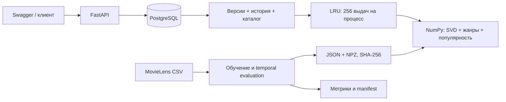

# Устройство RecoTrail

## Запись события

Сервис блокирует строку пользователя, проверяет сохранённый ключ и хеш тела.
При совпадении возвращает исходный результат даже после появления более новых
событий; текущее состояние можно отдельно прочитать через `/me`.

Для нового ключа проверяется доступность фильма и время. Событие попадает
в `events`, а `user_item_state` меняется только при не более старом времени.
При равном времени порядок задаёт последовательность записей под блокировкой.
Вес последнего действия: view = 1, like = 3, dislike = 0. Просмотр после лайка
может снизить вес: хранится последнее действие, а не максимальный интерес.
Любой фильм из истории исключается из выдачи, включая отвергнутые.

Событие, состояние и версия профиля изменяются одной транзакцией. Ошибка обновления
профиля откатывает всё. Блокировка одного пользователя не мешает записи других.

## Чтение и кэш

`REPEATABLE READ` даёт одну версию профиля, истории, каталога и активной модели.
После чтения транзакция закрывается, расчёт выполняется в отдельном потоке.
Если в этот момент приходит новое событие, текущий запрос возвращает согласованный
предыдущий снимок, а следующий видит новую версию.

Ключ кэша: user_id, profile_version, catalog_version, model_version, algorithm, limit.
Кэш ограничен 256 записями на процесс; после перезапуска заполняется заново.
Максимум два расчёта выполняются одновременно в каждом процессе API.
Каталог ограничен 10 000 строками. Распределённого кэша нет.

Неактивные фильмы остаются в базе и могут объяснять прошлые интересы, но исключены
из выдачи. Нормализация оценок использует весь сохранённый каталог. Оценки
предназначены для сортировки, сравнивать их между версиями нельзя.

## Модель

Offline CLI экспортирует факторы и популярность в NPZ, метаданные — в JSON.
Оператор файловой системы регистрирует локальный артефакт; публичного загрузчика нет.
При первой загрузке проверяются manifest, SHA, размерности и конечность чисел.
Проверенный объект хранится в памяти. Версии неизменяемы: замена файлов на месте
не поддерживается.

Администратор переключает зарегистрированную версию одной транзакцией.
Начатые запросы завершаются на прежней модели. Обратное переключение возвращает
предыдущую модель. Изменение списка жанров отклоняется без явной миграции профилей.

События API меняют профиль, но глобальные факторы остаются прежними до нового
обучения и активации. Брокер здесь не нужен: обратная связь записывается короткой
транзакцией, обучение оператор запускает отдельно.
